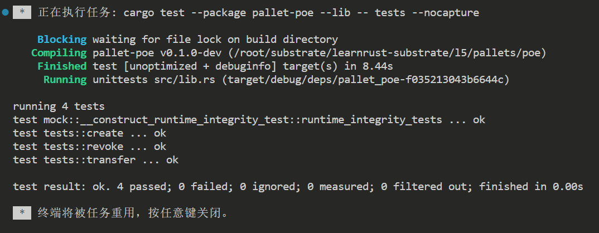
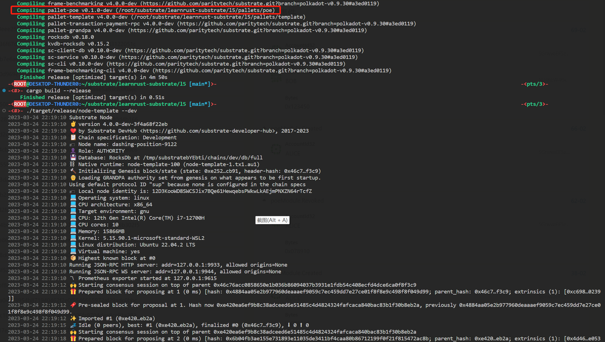
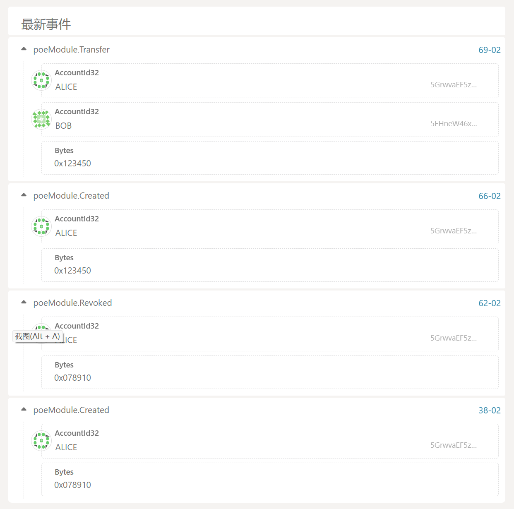
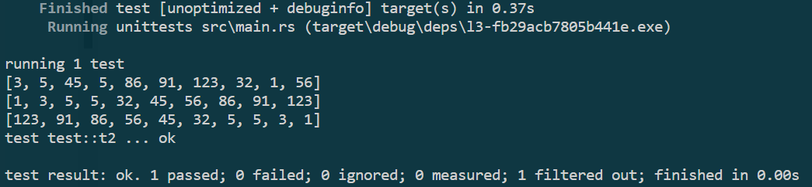

# learnrust-substrate

## l6

[题4代码](l6/main.ts)

## l5

[题5,6代码](l5/pallets/poe/src/lib.rs)

## l4

[题5代码](l4/src/uutils/traffic_light.rs)

[题6代码](l4/src/uutils/tools.rs)

[题7代码](l4/src/uutils/graph.rs)

## l3

[题5代码](l3/src/main.rs)

